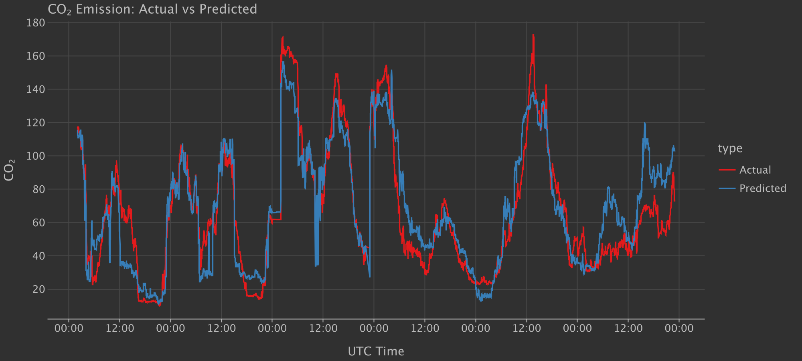

# Danish Power ML

A Kotlin project for fetching and analyzing data from the [Energi Data Service - PowerSystemRightNow dataset](https://www.energidataservice.dk/dataset/PowerSystemRightNow).

## Overview

This project includes a Kotlin notebook that trains a simple XGBoost model to predict CO2 emissions from time series data.

## Results

### CO2 Emission Predictions

